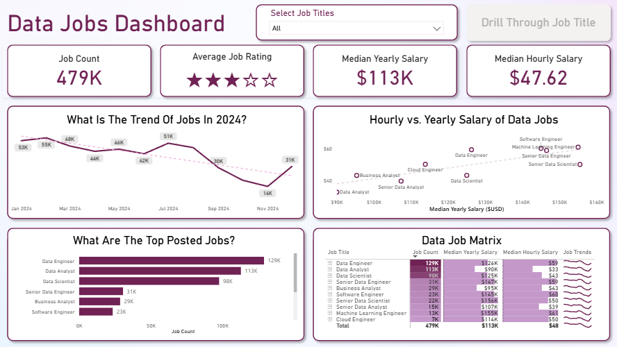
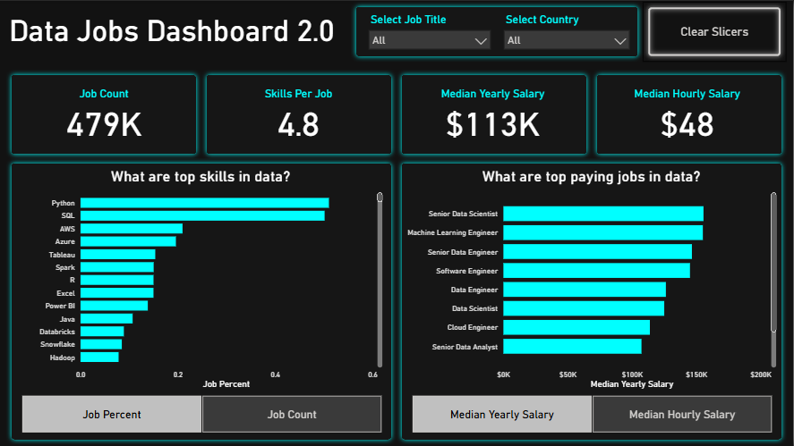

# Power BI Data Jobs Dashboard Projects

## Overview
The Data Jobs Dashboard is an interactive Power BI project built to analyze trends in the global data science job market (2024).
It helps job seekers, career switchers, and data professionals explore insights such as job demand, salaries, and locations in one place — transforming raw job posting data into actionable visuals.

This repository contains two dashboard versions, each created to explore different design styles and Power BI techniques while using the same dataset.

## 🗂️ Repository Structure
```
Data-Jobs-Dashboard/
│
├── Data_Jobs_v1/
│   ├── Data_Jobs_Dashboard_v1.pbix
│   └── README.md
│   
│
├── Data_Jobs_v2/
│   ├── Data_Jobs_Dashboard_2.0.pbix
│   └── README.md
│
├── images/
└── README.md   ← (This file)
```
## 📊 Featured Dashboards
### Data Jobs Dashboard (v1-Comprehensive Exploration)


**Key Power BI Skills Utilised:**
- 🎨 **Dashboard Layout & Design:** Structured visuals for clear storytelling and aesthetic balance.
- ⚙️ **Power Query (ETL & Data Shaping):** Cleaned and transformed raw job data for reporting.
- 🔗 **Basic Data Modeling:** Established table relationships for seamless data integration.
- 🧮 **Implicit Measures & Aggregations:** Leveraged Power BI’s built-in aggregations for key KPIs.
- 📊 **Core Visuals:** Utilized bar, line, area, and column charts for comparative insights.
- 🗺️ **Map Visualizations:** Displayed global job distribution through geospatial mapping.
- 🔢 **KPI Cards & Tables:** Highlighted critical metrics and detailed job-level data.
- 🖱️ **Interactive Slicers:** Enabled dynamic filtering by job title, region, and experience.
- 🔘 **Buttons & Bookmarks:** Implemented intuitive navigation between dashboard views.
- ➡️ **Drill-Through Pages:** Allowed users to explore granular job insights interactively.

[**View Full Project 1 Details (README)**](Data_Jobs_v1/README.md)

### Data Jobs Dashboard 2.0 (V2 - Single-Page Focus)


**Key Power BI Skills Utilized (demonstrating progression):**
- 🎨 **Advanced Dashboard Design:** Built a refined single-page layout emphasizing clarity and user experience.
- ⚙️ **Complex Power Query Transformations:** Performed advanced data cleaning and custom column creation.
- 🔗 **Star Schema Modeling:** Applied dimensional modeling best practices for performance and scalability.
- 🧮 **Explicit DAX Measures:** Created reusable measures using functions like CALCULATE, FILTER, and ALL.
- 📊 **Dynamic Visualizations:** Introduced slicer-driven and parameter-based visuals for real-time data exploration.
- ⚙️ **“What-If” Parameters:** Implemented field and numeric parameters for scenario-based analysis.
- 🗺️ **Enhanced Geospatial Insights:** Improved location-based visual accuracy and responsiveness.
- 🔢 **Advanced Card Visuals:** Incorporated data-driven KPIs with conditional formatting and icons.
- 📈 **Optimized Interactivity:** Refined slicers, cross-filtering logic, and visual hierarchies for smoother UX.
- ⚡ **Performance Optimization:** Reduced visual load times through data model tuning, query folding, and minimized visuals.

[**View Full Project 2 Details (README)**](Data_Jobs_v2/README.md)

### Note:

Each dashboard linked above has its own detailed `README.md` file within its respective project folder. These offer deeper insights into the project objectives, data sources, specific Power BI techniques employed, and a closer look at the dashboard build.

---
## Conclusion

The Data Jobs Dashboard demonstrates how Power BI can transform scattered job market data into a cohesive, interactive analytics experience.
By comparing both versions, you can trace the evolution from a basic analytical report to a fully interactive professional dashboard — highlighting iterative learning, design thinking, and real-world analytical application.