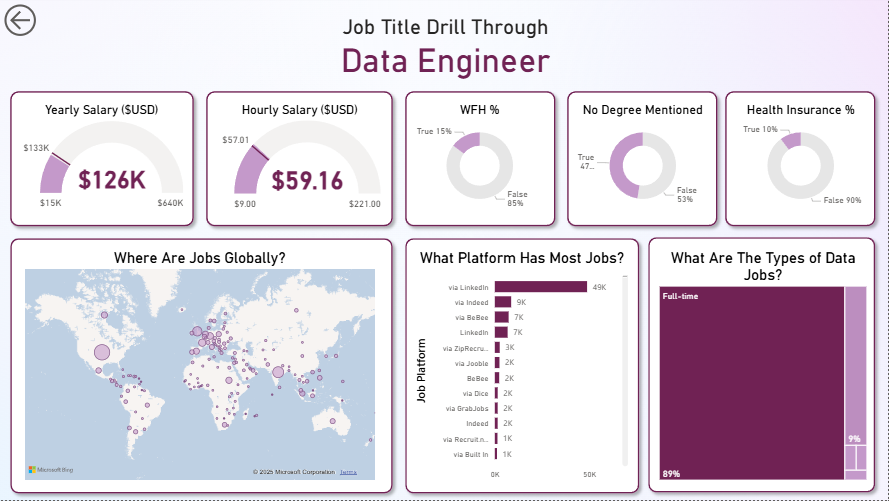

# Data Jobs Dashboard with Power BI

## Introduction
The Data Jobs Dashboard was built for job seekers, career switchers, and professionals exploring the data domain.
In today's job market, reliable information on salaries, roles, and demand trends is scattered across platforms — making it difficult to get a clear picture.

This Power BI project brings everything together in one interactive report, using a real-world dataset of 2024 Data Science job postings. It provides a consolidated view of job titles, compensation, and global market trends — helping users make data-driven career decisions.

### Dashboard File
[`Data_Jobs_Dashboard.pbix`](Data_Jobs_Dashboard.pbix)

## Skills Showcased

This project highlights several essential Power BI capabilities and data analytics techniques:

-   **⚙️ Data Transformation (ETL) with Power Query:** Cleaned, reshaped, and enriched the dataset — handled missing values, changed data types, and added calculated columns for better analysis.
-   **🧮 Implicit Measures:** Created measures to compute insights like `Median Yearly Salary`, `Job Count`, and other performance indicators.
-   **📊 Core Charts:** Used a mix of **Column, Bar, Line, and Area Charts** to compare job counts, salary trends, and growth patterns.
-   **🗺️ Geospatial Analysis:** Integrated **Map visuals** to depict the worldwide distribution of data jobs.
-   **🔢 KPI Indicators & Tables:** Used **Cards** to display key metrics and **Tables** to provide granular, sortable data.
-   **🎨 Dashboard Design & Aesthetics:**Focused on a clean, intuitive layout — ensuring the visual storytelling complements the data insights.
-   **🖱️ Interactive Reporting:**
    -   **Slicers** to filter by job title or location.
    -   **Buttons & Bookmarks** for seamless navigation.
    -   **Drill-Through** for detailed exploration of specific job roles.
---
## Dashboard Overview

*The report is divided into two key pages for both overview and in-depth exploration:*

### Page 1: High-Level Market Overview

  

The command center for the data job market — this page provides an at-a-glance summary of total job counts, median salaries, and the top job titles in demand.

### Page 2: Job Title Drill Through

  

Dive deeper into a specific role with detailed insights — salary distributions, remote job ratios, hiring platforms, and geographic trends across the globe.

---

## Conclusion

The Data Jobs Dashboard demonstrates how Power BI can turn raw job posting data into an interactive decision-making tool. It empowers users to filter, slice, and explore insights, transforming unstructured data into actionable knowledge for career planning and analysis.
